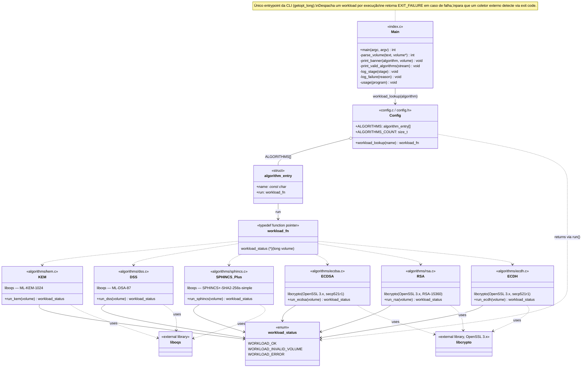

```mermaid
classDiagram
    class Main {
        <<index.c>>
        +main(argc, argv) int
        -parse_volume(text, volume*) int
        -print_banner(algorithm, volume) void
        -print_valid_algorithms(stream) void
        -log_stage(stage) void
        -log_failure(reason) void
        -usage(program) void
    }

    class Config {
        <<config.c / config.h>>
        +ALGORITHMS: algorithm_entry[]
        +ALGORITHMS_COUNT: size_t
        +workload_lookup(name) workload_fn
    }

    class algorithm_entry {
        <<struct>>
        +name: const char*
        +run: workload_fn
    }

    class workload_fn {
        <<typedef function pointer>>
        workload_status (*)(long volume)
    }

    class workload_status {
        <<enum>>
        WORKLOAD_OK
        WORKLOAD_INVALID_VOLUME
        WORKLOAD_ERROR
    }

    class KEM {
        <<algorithms/kem.c>>
        liboqs — ML-KEM-1024
        +run_kem(volume) workload_status
    }

    class DSS {
        <<algorithms/dss.c>>
        liboqs — ML-DSA-87
        +run_dss(volume) workload_status
    }

    class SPHINCS_Plus {
        <<algorithms/sphincs.c>>
        liboqs — SPHINCS+-SHA2-256s-simple
        +run_sphincs(volume) workload_status
    }

    class RSA {
        <<algorithms/rsa.c>>
        libcrypto (OpenSSL 3.x, RSA-15360)
        +run_rsa(volume) workload_status
    }

    class ECDSA {
        <<algorithms/ecdsa.c>>
        libcrypto (OpenSSL 3.x, secp521r1)
        +run_ecdsa(volume) workload_status
    }

    class ECDH {
        <<algorithms/ecdh.c>>
        libcrypto (OpenSSL 3.x, secp521r1)
        +run_ecdh(volume) workload_status
    }

    class liboqs {
        <<external library>>
    }

    class libcrypto {
        <<external library, OpenSSL 3.x>>
    }

    Main --> Config : workload_lookup(algorithm)
    Config o-- algorithm_entry : ALGORITHMS[]
    algorithm_entry --> workload_fn : run
    Config ..> workload_status : returns via run()

    workload_fn ..> KEM
    workload_fn ..> DSS
    workload_fn ..> SPHINCS_Plus
    workload_fn ..> ECDSA
    workload_fn ..> RSA
    workload_fn ..> ECDH

    KEM --> workload_status
    DSS --> workload_status
    SPHINCS_Plus --> workload_status
    ECDSA --> workload_status
    RSA --> workload_status
    ECDH --> workload_status

    KEM ..> liboqs : uses
    DSS ..> liboqs : uses
    SPHINCS_Plus ..> liboqs : uses
    ECDSA ..> libcrypto : uses
    RSA ..> libcrypto : uses
    ECDH ..> libcrypto : uses

    note for Main "Único entrypoint da CLI (getopt_long).\nDespacha um workload por execução\ne retorna EXIT_FAILURE em caso de falha,\npara que um coletor externo detecte via exit code."
```