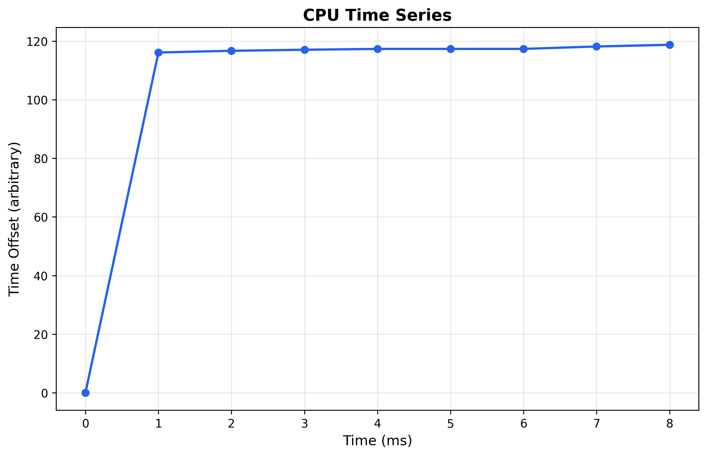
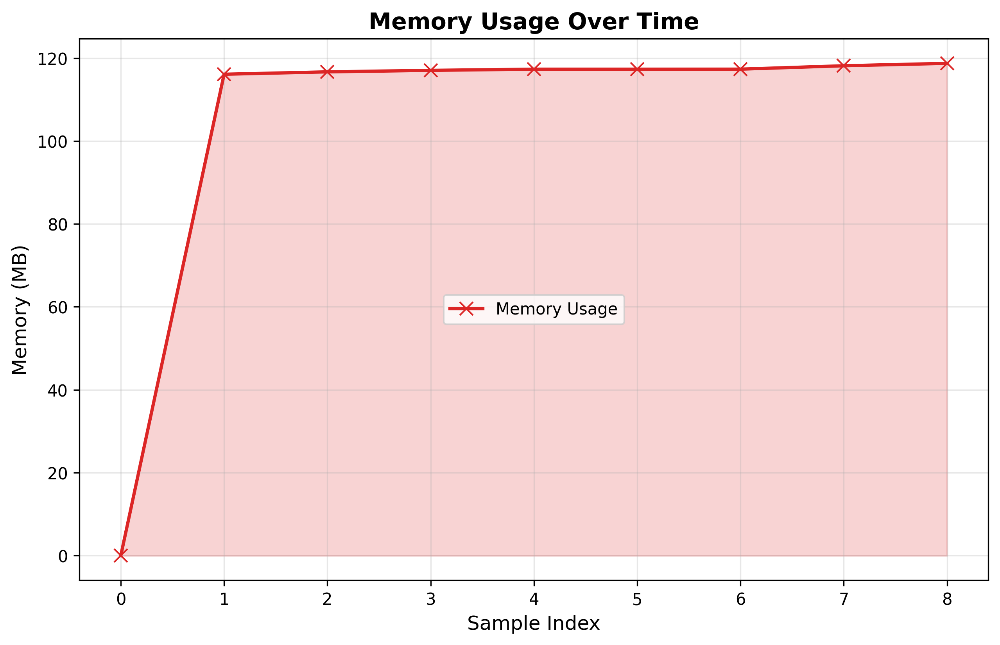

# KEM - 07-11-2025 16h31m16s.258

## Resumo

**Algoritmo**: KEM
**Tipo de Desafio**: <function run_mlkem at 0x0000028595010E00>
**Volume**: 1 operações
**Status**: success
**Duração**: 8056.11 ms
**Seed**: 42

## Hardware

**CPU**: Intel(R) Core(TM) i5-10500H CPU @ 2.50GHz
**Arquitetura**: X86_64
**Cores Físicos**: 6
**Cores Lógicos**: 12
**Frequência**: 2496 MHz
**RAM Total**: 15.78 GB

## Métricas Coletadas

| Métrica     | Valor              |
|-------------|--------------------|
| CPU Time    | 0.00 ms            |
| Memory Peak | 0.00 MB            |
| CPU Cycles  | N/A (indisponível) |

## Gráficos

---
*Relatório gerado em 07-11-2025 16h31m28s*